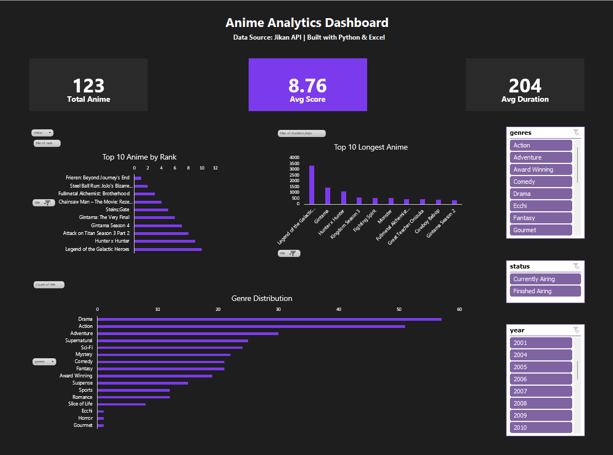

# 🎬 Anime Data Analytics Dashboard

An end-to-end data analytics project that collects, processes, and visualizes anime data using Python and Excel.

---

## 📌 Project Overview

This project demonstrates a complete data workflow:

* Fetching real-world data from an API
* Cleaning and transforming data using Python
* Building an interactive dashboard in Excel

The goal is to turn raw data into meaningful insights through visualization and user interaction.

---

## 🛠️ Tools & Technologies

* **Python**

  * requests (API calls)
  * pandas (data processing)
* **Excel**

  * Pivot Tables
  * Charts
  * Slicers (interactive filters)

---

## 🔄 Data Pipeline

1. Fetch data from **Jikan API**
2. Convert JSON → Pandas DataFrame
3. Clean data:

   * Handle missing values (`.get()`)
   * Convert data types (rank, dates)
   * Remove invalid rows
4. Transform data:

   * Calculate `duration_days`
   * Explode genres for analysis
5. Export to Excel for dashboard creation

---

## 📊 Dashboard Features

* 🎯 **KPI Cards**

  * Total Anime (Distinct Count)
  * Average Score
  * Average Duration

* 📈 **Visualizations**

  * Top 10 Anime by Rank
  * Top 10 Longest Anime
  * Genre Distribution

* 🎛️ **Interactive Filters (Slicers)**

  * Genre
  * Status
  * Year

---

## 📸 Dashboard Preview



---

## 📁 Project Structure

```
anime-data-dashboard/
│
├── src/
│   └── anime_data.py        # Data collection & processing
│
├── data/
│   └── anime_dataset.xlsx   # Cleaned dataset
│
├── dashboard/
│   └── anime_dashboard.xlsx # Final Excel dashboard
│
├── images/
│   └── dashboard.png        # Screenshot
│
└── README.md
```

---

## ▶️ How to Run

1. Clone the repository

```
git clone https://github.com/your-username/anime-data-dashboard.git
```

2. Run the Python script

```
python src/anime_data.py
```

3. Open the Excel dashboard

```
dashboard/anime_dashboard.xlsx
```

---

## 💡 Notes

* Top 10 calculations are implemented in Python for validation purposes
* The Excel dashboard uses PivotTables and Slicers for dynamic interaction

---

## 🚀 Future Improvements

* Add automation (auto-refresh Excel data)
* Integrate Power BI or Tableau version
* Deploy as a web dashboard

---

## 👤 Author

* Name: Tee
* GitHub: nemui08
* Role: Aspiring Data Analyst

---

⭐ If you like this project, feel free to star the repo!
